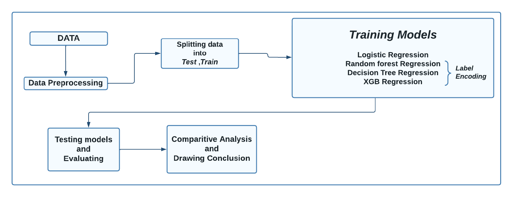

# GeoSense-Rock-vs.-Mine-Detection-System

This repository contains the implementation of a machine learning pipeline to predict whether an underwater object detected via sonar is a rock or a mine.

---

## Problem Objective

Develop a machine learning model to classify objects (rock or mine) based on sonar signal features. The dataset used includes sonar returns with extracted features such as frequency bands, signal intensities, and waveform characteristics.

---

## Dataset

- **Source**: [Kaggle Sonar Dataset](https://www.kaggle.com/datasets/rupakroy/sonarcsv)
- **Size**: 208 rows × 61 columns
- **Features**:
  - **Frequencies**: Measurements of signal frequencies.
  - **Amplitudes**: Intensity of sonar signal returns.
  - **Time-domain features**: Echoes and temporal patterns.
  - **Statistical measures**: Mean, variance, skewness, kurtosis of signal properties.
  - **Waveform analysis**: Signal shape and spatial characteristics.

---

## Approach

## Workflow


---

## Results

The Logistic Regression model was identified as the most suitable for this problem based on:
- High accuracy and precision.
- Low false positive rate for rocks.

---

## Real-World Application

This project addresses real-world challenges in underwater object detection using sonar data. The binary classification model has the potential to enhance decision-making in marine exploration, defense applications, and underwater robotics.

---

## Future Scope

- Expanding feature engineering to include more sonar signal characteristics.
- Experimenting with ensemble methods to improve classification accuracy further.
- Developing a real-time sonar classification system.

---

## How to Run the Project

1. Clone the repository:
   ```bash
   git clone https://github.com/Nagathejas-M-S/GeoSense-Rock-vs.-Mine-Detection-System.git

2. Run the Python notebook file:
   ```bash
   Rock_vs_Mine_Prediction.ipynb
